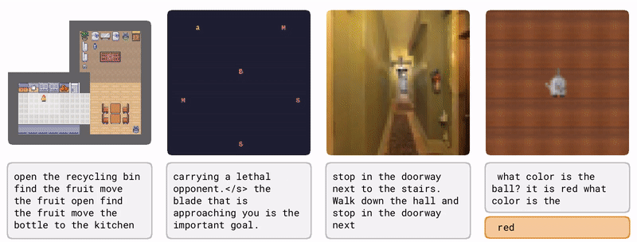

# Learning to Model the World with Language



This repository contains the code for the paper [Learning to Model the World with Language](https://dynalang.github.io). We introduce Dynalang, an agent that leverages diverse types of language to solve tasks by using language to predict the future via a multimodal world model.

For more information, check out:
- [Project Site](https://dynalang.github.io/)
- [Paper](https://arxiv.org/abs/2308.01399)

# Getting Started

Install dependencies:
```
pip install -e .
```

## 🏠 HomeGrid

Install the HomeGrid environment and run the example training script with the task name (`homegrid_task`, `homegrid_future`, `homegrid_dynamics`, or `homegrid_corrections`):

```bash
pip install homegrid
sh scripts/run_homegrid.sh homegrid_task EXP_NAME GPU_IDS SEED
```

## 👾 Messenger

1. Install dependencies for the Messenger env:
```bash
sudo apt-get install \
  libsdl-image1.2-dev libsdl-mixer1.2-dev libsdl-ttf2.0-dev \
  libsdl1.2-dev libsmpeg-dev subversion libportmidi-dev ffmpeg \
  libswscale-dev libavformat-dev libavcodec-dev libfreetype6-dev
```

2. Clone the Messenger environment and install it:
```bash
git clone https://github.com/ahjwang/messenger-emma 
pip install -e messenger-emma
```

3. Download the pre-embedded sentences from [Google Drive](https://drive.google.com/drive/u/0/folders/1XuacEUmWAvPtYBJ5YEc21yV7aExzPY1X) and place the `pkl` file into `dynalang/embodied/envs/data`.

4. Run the example training script for s1, s2, or s3:
```bash
sh scripts/run_messenger_s1.sh EXP_NAME GPU_IDS SEED
```

## 🛋 VLN

1. Install dependencies for VLN. Since VLN-CE depends on an older version of the Habitat simulator, we provide a conda yml file with pinned dependency versions and recommend you install the same version of JAX.
```bash
conda create -n dynalang-vln python=3.8
pip install "jax[cuda11_cudnn82]==0.4.8" -f https://storage.googleapis.com/jax-releases/jax_cuda_releases.html
pip install torch torchvision
conda env update -f env_vln.yml
conda install -c aihabitat -c conda-forge habitat-sim=0.1.7 headless
```

2. Clone our VLN-CE and habitat-lab forks into this project repo:
```bash
git clone https://github.com/jlin816/VLN-CE VLN_CE
git clone https://github.com/jlin816/habitat-lab habitat_lab
```

3. Download Matterport3D data into the VLN-CE directory (requires Python 2.7): [additional instructions](https://github.com/facebookresearch/habitat-sim/blob/main/DATASETS.md#matterport3d-mp3d-dataset)

```bash
conda create -n py27 python=2.7
conda activate py27
python scripts/download_mp.py --task habitat -o VLN_CE/data/scene_datasets/mp3d/
cd VLN_CE/data/scene_datasets
unzip mp3d/v1/tasks/mp3d_habitat.zip
conda deactivate
```

Scenes should now be populated into directories under `VLN_CE/data/scene_datasets/mp3d/{scene_dir}/...`.

4. Download Room-to-Room dataset into the VLN_CE directory: [additional instructions](https://github.com/jacobkrantz/VLN-CE#episodes-room-to-room-r2r)

```bash
mkdir -p VLN_CE/data/datasets
cd VLN_CE/data/datasets
gdown https://drive.google.com/uc?id=1kQ_at68wiK2vAmlWbjJ4EDrLtaM0nfkR
unzip R2R_VLNCE_v1-3_preprocessed.zip
```

5. Download the pre-embedded sentences from [Google Drive](https://drive.google.com/drive/u/0/folders/1XuacEUmWAvPtYBJ5YEc21yV7aExzPY1X) and place the `pkl` file into `dynalang/embodied/envs/data`.

6. Run the example training script:
```bash
sh scripts/run_vln.sh EXP_NAME GPU_IDS SEED
```

## 💬 LangRoom

LangRoom must be run from the `langroom` branch, which contains changes to support LangRoom's dictionary action space for moving and talking simultaneously. Install the LangRoom environment and run the example training script: 
```bash
git checkout langroom
pip install langroom
sh run_langroom.sh EXP_NAME GPU_IDS SEED
```

## 📑 Text Pretraining and Finetuning

Install additional dependencies and run the example training script to train on TinyStories. By default, the script initializes a model with the observation and action space of the Messenger S2 task and monitors loss on a replay buffer while training. You'll need to pass a path to the `.../episodes/` directory (containing the `.npz` chunks) of a previous Messenger S2 agent if you want to do the same.

```bash
pip install datasets
sh scripts/pretrain_text.sh EXP_NAME GPU_IDS SEED roneneldan/TinyStories /PATH/TO/EVAL/REPLAY/EPISODES
```

To load a pretrained world model into an agent for finetuning, run the train script with the following flags (`load_wm_ckpt` only loads the weights of the world model and initializes the rest of the agent from scratch):
```bash
python dynalang/train.py \
  --load_wm_ckpt True \
  --run.from_checkpoint /path/to/pretraining/checkpoint.pkl \
  ...
```

# Training Configuration Tips

- Note that to use the same batch sizes as we did in the paper, you may have to use more than one GPU. To do so, run the script with a list of GPU IDs and additionally specify which GPUs should be used for training the world model and running the policy (e.g. `sh run_messenger_s3.sh EXP_NAME 0,1,2,3 SEED --jax.train_devices 0,1,2,3 --jax.policy_devices 0`.
- You may want to use the `parallel` script for training speedups. See `scripts/run_vln.sh` for an example.

# Acknowledgments

This repo is adapted from [DreamerV3](https://github.com/danijar/dreamerv3).

# Citation

```
@article{lin2023learning,
         title={Learning to Model the World with Language},
         author={Jessy Lin and Yuqing Du and Olivia Watkins and Danijar Hafner and Pieter Abbeel and Dan Klein and Anca Dragan},
         year={2023},
         eprint={2308.01399},
         archivePrefix={arXiv},
}
```
